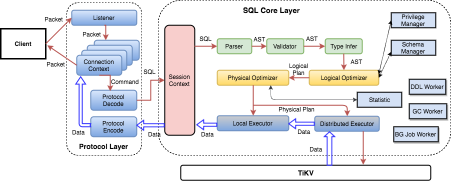

# System R 优化器框架

## 概览

让我们再次回到这张图，



我们在 project 2 中介绍了 SQL Parser 能够将 SQL 文本转换为数据库更容易处理的 AST 格式，从 Parser 往后，我们恩能够看到 Validator 和 Type Infer 两个流程。这两部分对应的是 SQL 合法性验证和类型系统，在实际的、用于生产环境的数据库系统中，这两部分十分重要，我们需要首先验证 SQL 的合法性，并且能够在预先定义的类型系统中成功识别和转换，以方便接下来的处理。不过由于这部分的内容略微枯燥，因此不作为 TinySQL 的课程内容，有兴趣的同学可以自行了解。

接下来我们就看到第二行中依次出现了两个流程，Logical Optimizer 和 Physical Optimizer, 这里实际上是对应 System R 优化器框架中的概念，接下来，让我们进入这一节的内容。

## TinySQL 中基于 System R 框架的优化器

System R 两阶段模型可以说是现代数据库基于代价优化（Cost based optimize）的优化器的鼻祖。由于优化器框架的特殊性，我们将结合代码来介绍这一概念。

从上图中可以看到，在进入优化器之前，数据依然是 AST 格式，接下来优化器会生成 Physical Plan 即 物理执行计划交由执行器执行。实际上，在进入优化器之前，我们就已经将 AST 格式的数据转换为 Plan(计划) 格式。
在 `/planner/optimize.go:func Optimize()` 中我们可以看到：

```go
...
// build logical plan
...
p, err := builder.Build(ctx, node)
```

这里便是由 node(AST) 生成对应的 p(Plan)。

接下来，在这个函数的末尾，我们能够看到进入优化器的入口：

```go
	// Handle the logical plan statement, use cascades planner if enabled.
	if sctx.GetSessionVars().EnableCascadesPlanner {
		finalPlan, err := cascades.DefaultOptimizer.FindBestPlan(sctx, logic)
		return finalPlan, names, err
	}
	finalPlan, err := plannercore.DoOptimize(ctx, builder.GetOptFlag(), logic)
```

如你所见，这里实际上表明了在 TinySQL 中存在两个优化器框架，Cascades 和我们提到的 System R。[最初的论文](https://15721.courses.cs.cmu.edu/spring2018/papers/15-optimizer1/graefe-ieee1995.pdf)里对 Cascades 架构的设计理念做了一个比较细致的讲解。

[TiDB Cascades Planner 原理解析](https://pingcap.com/blog-cn/tidb-cascades-planner/) 这篇文章对 Cascades 在 TiDB 中的实现做了比较细致的讲解，大家可以通过这篇博客结合 TinySQL 的代码进行学习。TiDB 和 TinySQL 在关键概念释义上是完全一样的。概念名词可以直接在 TinySQL 找到。

不过 Cascades 目前不是 TinySQL 重点介绍的优化器框架，我们在这里简单略过，感兴趣的同学可以自行了解。

在上面代码片段中的最后一行即是 System R 优化器的入口 `plannercore.DoOptimize`, 位于 `planner/core/optimizer.go`
```go
// DoOptimize optimizes a logical plan to a physical plan.
func DoOptimize(ctx context.Context, flag uint64, logic LogicalPlan) (PhysicalPlan, error) {
	logic, err := logicalOptimize(ctx, flag, logic)
	if err != nil {
		return nil, err
	}
	physical, err := physicalOptimize(logic)
	if err != nil {
		return nil, err
	}
	finalPlan := postOptimize(physical)
	return finalPlan, nil
}
```

该函数的逻辑十分简单，只是依次调用了 `logicalOptimize`， `physicalOptimize` 和 `postOptimize`。其中，前两者就是最开始图中提到的优化流程，最后的 `postOptimize` 实际上一些优化之后对执行计划的一些调整，例如去掉多余的 projection 算子等。

### 逻辑优化

逻辑优化，即 logical optimize, 入口位于 `planner/core/optimizer.go`。逻辑优化做的事情实际上并不复杂：
```go
func logicalOptimize(ctx context.Context, flag uint64, logic LogicalPlan) (LogicalPlan, error) {
	var err error
	for i, rule := range optRuleList {
		// The order of flags is same as the order of optRule in the list.
		// We use a bitmask to record which opt rules should be used. If the i-th bit is 1, it means we should
		// apply i-th optimizing rule.
		if flag&(1<<uint(i)) == 0 {
			continue
		}
		logic, err = rule.optimize(ctx, logic)
		if err != nil {
			return nil, err
		}
	}
	return logic, err
}
```

在逻辑优化中，我们会依次遍历优化规则列表，并对当前的执行计划树尝试优化。在 TinySQL 中，我们有
```go
var optRuleList = []logicalOptRule{
	&columnPruner{},
	&buildKeySolver{},
	&aggregationEliminator{},
	&projectionEliminator{},
	&maxMinEliminator{},
	&ppdSolver{},
	&outerJoinEliminator{},
	&aggregationPushDownSolver{},
	&pushDownTopNOptimizer{},
	&joinReOrderSolver{},
}
```
这些规则，我们接下来会对 `columnPruner` 即列裁剪作为例子进行讲解。

每一个优化规则的相关代码都放在了 `planner/core` 下的一个单独文件中，具体来讲，`columnPruner` 的具体实现位于 `planner/core/rule_column_pruning.go` 中。

列裁剪的目的是为了裁掉不需要读取的列，以节约 IO 资源。例如，对于有 a, b, c, d 四列的表 t 来说：
```sql
select a from t where b > 5;
```
这个查询实际上只需要用到 a, b 两列，所以 c, d 两列是不需要读取的，因此可以将他们裁剪掉。

列裁剪的算法实现是自顶向下地把算子过一遍。某个节点需要用到的列，等于它自己需要用到的列，加上它的父节点需要用到的列。可以发现，由上往下的节点，需要用到的列将越来越多。

列裁剪主要影响的算子是 Projection，DataSource，Aggregation，因为它们跟列直接相关。Projection 里面会裁掉用不上的列，DataSource 里面也会裁剪掉不需要使用的列。

Aggregation 算子会涉及哪些列？group by 用到的列，以及聚合函数里面引用到的列。比如 `select avg(a), sum(b) from t group by c d`，这里面 group by 用到的 c 和 d 列，聚合函数用到的 a 和 b 列。所以这个 Aggregation 使用到的就是 a b c d 四列。

Selection 做列裁剪时，要看它父节点要哪些列，然后它自己的条件里面要用到哪些列。Sort 就看 order by 里面用到了哪些列。Join 则要把连接条件中用到的各种列都算进去。具体的代码里面，各个算子都是实现 PruneColumns 接口：

```go
func (p *LogicalPlan) PruneColumns(parentUsedCols []*expression.Column)
```

通过列裁剪这一步操作之后，查询计划里面各个算子，只会记录下它实际需要用到的那些列。

回到代码中，我们在逻辑优化入口处可以得知， `rule.optimize` 是每个规则的入口，对应在这里就是
```go
func (s *columnPruner) optimize(ctx context.Context, lp LogicalPlan) (LogicalPlan, error) {
	err := lp.PruneColumns(lp.Schema().Columns)
	return lp, err
}
```

其中 `lp` 是计划树的根节点，从根节点开始遍历，即自顶向下进行上面描述的算法。

### 物理优化

物理优化，即 physical optimize, 入口也是在 `/planner/core/optimizer.go` 中。

[physicalOptimize](https://github.com/pingcap-incubator/tinysql/blob/df75611ce926442bd6074b0f32b1351ca4aad925/planner/core/optimizer.go#L112) 是物理优化的入口。这个过程实际上是一个记忆化搜索的过程。

其记忆化搜索的过程大致可以用如下伪代码表示：

```
// The OrderProp tells whether the output data should be ordered by some column or expression. (e.g. For select * from t order by a, we need to make the data ordered by column a, that is the exactly information that OrderProp should store)
func findBestTask(p LogicalPlan, prop OrderProp) PhysicalPlan {

	if retP, ok := dpTable.Find(p, prop); ok {
		return retP
	}
	
	selfPhysicalPlans := p.getPhysicalPlans()
	
	bestPlanTree := a plan with maximum cost
	
	for _, pp := range selfPhysicalPlans {
	
		childProps := pp.GetChildProps(prop)
		childPlans := make([]PhysicalPlan, 0, len(p.children))
		for i, cp := range p.children {
			childPlans = append(childPlans, findBestTask(cp, childProps[i])
		}
		physicalPlanTree, cost := connect(pp, childPlans)
		
		if physicalPlanTree.cost < bestPlanTree.cost {
			bestPlanTree = physicalPlanTree
		}
	}
	return bestPlanTree
}
```

实际的执行代码可以在[findBestTask](https://github.com/pingcap-incubator/tinysql/blob/df75611ce926442bd6074b0f32b1351ca4aad925/planner/core/find_best_task.go#L95) 中查看，其逻辑和上述伪代码基本一致。

更多详细的内容可以参考 [TiDB 源码阅读文章（八）基于代价的优化](https://pingcap.com/zh/blog/tidb-source-code-reading-8)，TinySQL 的实现完全一致。

## 作业

完成 `rule_predicate_push_down.go` 中的 TODO 内容。

## 评分

通过 package `core` 下 `TestPredicatePushDown` 的测试。

你可以在根目录通过命令 `make test-proj4-1` 执行测试。

## 额外内容

如果你对 Cascades 优化器感兴趣，我们也提供了一个不是很完善的作业，你可以尝试完成 `transformation_rules.go` 中的 TODO 内容, 其对应的测试在 `transformation_rules_test.go` 中。

## References
- https://pingcap.com/zh/blog/tidb-source-code-reading-7
- https://pingcap.com/zh/blog/tidb-source-code-reading-8
